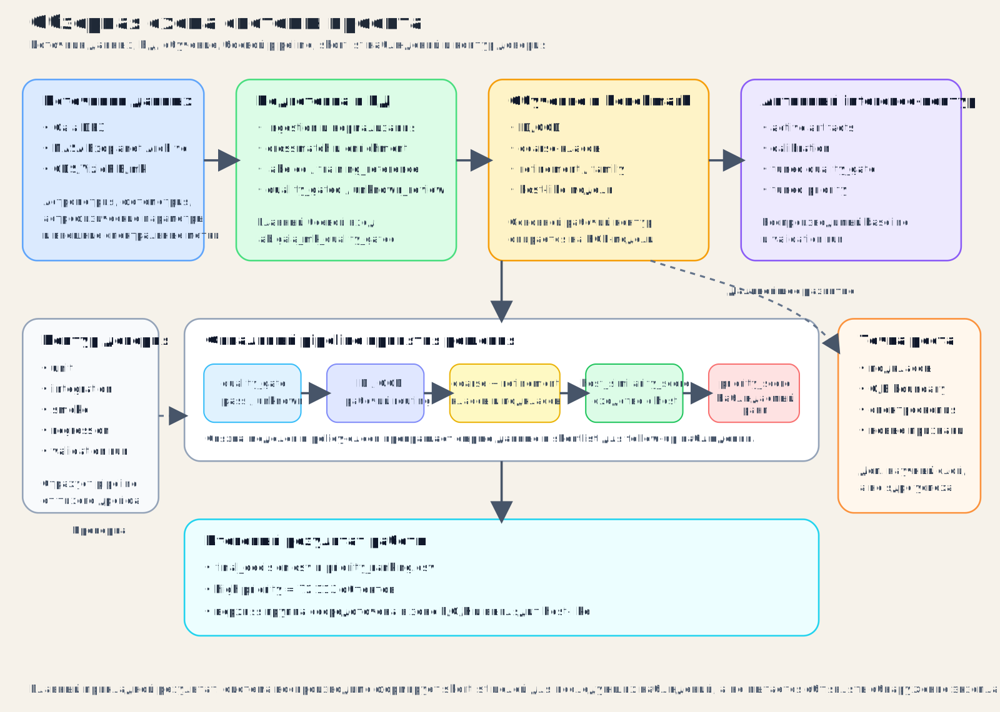

# ВКР: Приоритизация наблюдений и оценка вероятности наличия экзопланет

Выпускная квалификационная работа для МГТУ им. Н. Э. Баумана.

Тема работы:
`Data Science как инструмент приоритизации наблюдений и оценки вероятности наличия экзопланет на основе параметров звезд. Классификация звезд по спектральным классам и подклассам.`

## О чём этот проект

Проект посвящён двум связанным задачам, но с разным приоритетом:

- главной прикладной задаче: построению слоя отбора для последующих
  наблюдений объектов, похожих на звезды-хозяева экзопланет;
- поддерживающей научной задаче: классификации звезд по спектральным классам и
  подклассам.

Практически система делает следующее:

- читает и нормализует астрономические данные;
- сопоставляет внешние метки с Gaia DR3;
- обучает модели классификации;
- оценивает качество и надежность входных данных;
- отделяет рабочую область от сомнительных и внешних объектов;
- формирует итоговый приоритет наблюдений.

Главный прикладной результат текущей версии проекта:

- построен воспроизводимый слой верхнего приоритета для последующих наблюдений;
- верхняя группа состоит из `72 113` объектов;
- это не подтвержденные планетные системы, а список наиболее интересных
  кандидатов для дальнейшей проверки, похожих на звезды-хозяева экзопланет.

Важно:

- основная прикладная задача текущей версии проекта решена;
- контур обработки уверенно поднимает наверх спокойные объекты в зоне `F/G/K`,
  похожие на звезды-хозяева экзопланет, а не редкий горячий хвост;
- задача более глубокой подклассовой детализации остается отдельной точкой
  роста.

## Обзорная схема системы



## Зачем нужна работа

В задачах поиска экзопланет важна не только сама классификация звезд, но и
ответ на прикладной вопрос: какие объекты стоит наблюдать в первую очередь.

Проект решает именно эту задачу:

- переводит большие каталоги звезд в понятный инженерный контур;
- отделяет пригодные цели от шумных и сомнительных;
- дает интерпретируемое ранжирование объектов для последующих наблюдений.

Классификация по подклассам в этой логике нужна не сама по себе, а как
дополнительный физический слой, который помогает сделать итоговый список
более осмысленным.

## Какие модели используются

В слое сравнения моделей и контрольной оценки используются:

- `HGB` — `HistGradientBoostingClassifier`
- `MLP` — `Multi-Layer Perceptron Classifier`
- `GMM` — `Gaussian Mixture Model` classifier

Основной рабочий контур в текущей версии проекта опирается прежде всего на
`HistGradientBoostingClassifier`, потому что он лучше всего показал себя на
табличных данных и в иерархическом контуре.

Отдельно в проекте есть:

- модели coarse-классификации;
- family/refinement-модели для подклассов;
- слой постобработки для `ID/OOD`, `quality_gate` и итогового решения;
- модель сходства с популяцией звезд-хозяев для слоя приоритизации;
- слой ранжирования для итогового `priority_score`.

## Технологический стек

- `Python 3.13`
- `SQL`
- `ADQL`
- `PostgreSQL`
- `SQLAlchemy`
- `DBeaver`
- `Jupyter Notebook / JupyterLab`

## Основные библиотеки

Рабочие зависимости:

- `numpy`
- `pandas`
- `scipy`
- `scikit-learn`
- `joblib`
- `SQLAlchemy`
- `psycopg2-binary`
- `astropy`

Ноутбуки и визуализация:

- `matplotlib`
- `seaborn`
- `jupyterlab`
- `nbclient`

Проверка качества кода:

- `pytest`
- `mypy`
- `pyright`
- `ruff`

## Откуда взяты данные

Основные источники данных:

- [Gaia Archive DR3](https://gea.esac.esa.int/archive/)
- [NASA Exoplanet Archive](https://exoplanetarchive.ipac.caltech.edu/)

Дополнительный источник внешних спектральных меток:

- [CDS/VizieR B/mk](https://cdsarc.cds.unistra.fr/viz-bin/ReadMe/B/mk?format=html&tex=true)

Роль источников в проекте:

- `Gaia DR3` дает астрометрию, фотометрию, астрофизические параметры и quality-сигналы;
- `NASA Exoplanet Archive` дает внешний контекст по звездам-хозяевам и опорный
  слой для задачи поиска объектов, похожих на звезды-хозяева;
- `B/mk` используется как внешний источник спектральных меток для supervised-классификации.

## Какие данные используются

Ниже приведены основные группы признаков и полей, с которыми работает проект.

### 1. Идентификаторы и привязка объектов

- `source_id` — уникальный идентификатор источника в Gaia
- `ra`, `dec` — координаты объекта
- `hostname` — имя звезды-хозяина в NASA Archive
- `external_catalog_name`, `external_object_id` — идентификаторы внешнего каталога

### 2. Фотометрия и цвет

- `phot_g_mean_mag` — средняя звездная величина в полосе `G`
- `bp_rp` — цветовой индекс `BP-RP`

Эти поля помогают:

- разделять крупные спектральные группы;
- оценивать наблюдательную пригодность;
- строить простые физические срезы по цвету и яркости.

### 3. Астрометрия и качество измерений

- `parallax` — параллакс
- `parallax_over_error` — отношение параллакса к его ошибке
- `ruwe` — показатель качества астрометрического решения
- `non_single_star` — флаг возможной не-одиночности объекта
- `classprob_dsc_combmod_star` — вероятность того, что объект является звездой

Эти поля используются для:

- `quality_gate`;
- отделения надежных объектов от сомнительных;
- построения `ID/OOD` и вспомогательного слоя проверки.

### 4. Астрофизические параметры Gaia

- `teff_gspphot` — эффективная температура по `GSP-Phot`
- `logg_gspphot` — поверхностная гравитация
- `mh_gspphot` — металличность
- `radius_gspphot` — радиус по `GSP-Phot`
- `radius_flame` — радиус по `FLAME`
- `lum_flame` — светимость по `FLAME`
- `evolstage_flame` — стадия эволюции по `FLAME`

Эти параметры нужны для:

- coarse-классификации;
- классификации по подклассам;
- оценки сходства с популяцией звезд-хозяев;
- интерпретации верхнего слоя приоритета.

### 5. Горячие звезды и O/B-пограничный слой

Для анализа горячих звезд в проекте отдельно использовались:

- `spectraltype_esphs`
- `teff_esphs`
- `logg_esphs`
- `ag_esphs`
- `azero_esphs`
- `ebpminrp_esphs`

Эти поля нужны для:

- проверки границы `O/B`;
- анализа пограничных объектов;
- сравнения локальных меток с Gaia hot-star семантикой.

Это отдельный исследовательский контур проекта, а не центральный критерий
успеха основной прикладной задачи. Для текущей версии работы проблема `O/B`
рассматривается как честная точка дальнейшего развития, связанная с
ограничениями данных и потребностью во внешней спектроскопии.

### 6. Внешние метки для спектральной классификации

Проект использует и нормализует:

- спектральный класс;
- спектральный подкласс;
- класс светимости;
- производные признаки эволюционной стадии.

Именно на этом слое строится:

- coarse-классификация по крупным классам;
- refinement-слой по подклассам;
- отдельный разбор проблемных границ, например `O/B`.

Практически это означает:

- верхнеуровневая классификация уже хорошо поддерживает основной контур;
- глубокая детализация по подклассам полезна и научно интересна;
- но именно она сейчас сильнее всего зависит от ограничений текущих данных.

### 7. Данные для задачи поиска объектов, похожих на звезды-хозяева

Из связки `Gaia + NASA Exoplanet Archive` используются:

- подтвержденные объекты-хозяева как внешний ориентир для этой задачи;
- физические параметры звезд;
- таблицы `PSCompPars / Stellar Hosts`, связанные со звездами-хозяевами;
- кроссматч с Gaia `source_id`.

Практический смысл этого слоя:

- не доказать наличие планеты напрямую;
- а найти звезды, наиболее похожие на известные профили host-объектов.

## Что получается на выходе

Итоговый контур строит:

- `coarse`-класс звезды;
- `refinement`-подкласс;
- `ID / OOD / unknown` routing;
- `quality_gate` решение;
- `host_similarity_score`;
- `observability_score`;
- `priority_score`;
- итоговый список приоритетных целей для последующих наблюдений.

В результате проект отвечает на два вопроса:

1. к какому спектральному классу и подклассу ближе объект;
2. насколько этот объект интересен как цель для дальнейших наблюдений.

При этом центральный прикладной ответ проекта сейчас звучит так:

- какие объекты в первую очередь похожи на цели из популяции звезд-хозяев и
  должны попасть в верхний наблюдательный список.

## Структура репозитория

```text
src/exohost/
  cli/          - запуск сценариев проекта
  contracts/    - контракты колонок, датасетов и слоев правил
  datasets/     - загрузка и сборка dataframe
  db/           - материализация, SQL и слой таблиц
  evaluation/   - метрики и слой контрольной оценки
  features/     - подготовка признаков и training frames
  ingestion/    - разбор и нормализация внешних меток
  labels/       - логика спектральных меток
  models/       - модели и обертки применения
  posthoc/      - маршрутизация, фильтрация и итоговое решение
  ranking/      - приоритизация наблюдений
  reporting/    - обзорный слой и вспомогательные модули для ноутбуков
  training/     - обучение и контрольные прогоны

analysis/notebooks/
  eda/          - обзор данных и обучающих выборок
  research/     - исследовательские разборы
  technical/    - технический обзор работы контура и моделей

assets/
  diagrams/     - обзорная схема системы для README и презентации

tests/
  unit/         - локальные модульные проверки
  integration/  - короткие сквозные связки между слоями
  smoke/        - быстрые проверки стартового контура
  regression/   - поведенческий регресс `quality_gate`, `priority` и `decide`
```

## Тестовый контур

Проект использует четыре активных слоя тестирования:

- `unit` — проверяет локальную бизнес-логику, контракты и helper-слой;
- `integration` — проверяет короткие связки между несколькими модулями;
- `smoke` — подтверждает, что пакет и CLI не сломаны на старте;
- `regression` — страхует поведение системы на frozen fixtures.

Если нужно быстро понять тестовую структуру, смотри:

- [tests/README.md](/Users/evgeniikuznetsov/Desktop/dspro-vkr/tests/README.md)
- [tests/regression/README.md](/Users/evgeniikuznetsov/Desktop/dspro-vkr/tests/regression/README.md)

## Что посмотреть в репозитории в первую очередь

Если нужно быстро понять проект, лучше идти в таком порядке:

1. [analysis/notebooks/technical/final_decision_review.ipynb](/Users/evgeniikuznetsov/Desktop/dspro-vkr/analysis/notebooks/technical/final_decision_review.ipynb)
2. [assets/diagrams/system_overview_ru.svg](/Users/evgeniikuznetsov/Desktop/dspro-vkr/assets/diagrams/system_overview_ru.svg)
3. [analysis/notebooks/technical/model_pipeline_review.ipynb](/Users/evgeniikuznetsov/Desktop/dspro-vkr/analysis/notebooks/technical/model_pipeline_review.ipynb)
4. [analysis/notebooks/technical/host_priority_calibration_review.ipynb](/Users/evgeniikuznetsov/Desktop/dspro-vkr/analysis/notebooks/technical/host_priority_calibration_review.ipynb)
5. [analysis/notebooks/research/quality_gate_calibration.ipynb](/Users/evgeniikuznetsov/Desktop/dspro-vkr/analysis/notebooks/research/quality_gate_calibration.ipynb)
6. [analysis/notebooks/README.md](/Users/evgeniikuznetsov/Desktop/dspro-vkr/analysis/notebooks/README.md)
7. [tests/README.md](/Users/evgeniikuznetsov/Desktop/dspro-vkr/tests/README.md)
8. [tests/regression/README.md](/Users/evgeniikuznetsov/Desktop/dspro-vkr/tests/regression/README.md)

## База данных и внешний вход

Боевой вход текущего контура обработки:

- таблица `lab.gaia_mk_quality_gated`

Если внешний проверяющий не хочет использовать локальную БД, ему нужен CSV,
собранный из Gaia DR3 как минимум с такими полями:

- `source_id`, `ra`, `dec`
- `phot_g_mean_mag`, `bp_rp`
- `parallax`, `parallax_over_error`, `ruwe`
- `teff_gspphot`, `logg_gspphot`, `mh_gspphot`
- `radius_gspphot`, `radius_flame`, `lum_flame`, `evolstage_flame`
- `non_single_star`, `classprob_dsc_combmod_star`

Этого достаточно, чтобы проверить контур обработки модели на внешнем CSV из
Gaia. Для полного совпадения с базовым прогоном дополнительно нужен наш
локальный слой `quality_gate`.

## Как запустить проект локально

```bash
source .venv-v2/bin/activate
python -m pip install -r requirements-v2.txt
python -m pip install -e .
```

Базовые проверки:

```bash
.venv-v2/bin/ruff check src tests
.venv-v2/bin/mypy src tests
.venv-v2/bin/pyright src tests
.venv-v2/bin/pytest -q tests
```

Быстрый запуск только регресс-слоя:

```bash
.venv-v2/bin/pytest -q tests/regression
```

## Как запустить интерфейс в браузере

Интерфейсный слой поднимается через `Streamlit` и использует отдельный
манифест зависимостей [requirements-streamlit-v2.txt](/Users/evgeniikuznetsov/Desktop/dspro-vkr/requirements-streamlit-v2.txt).

Если `Streamlit` еще не установлен в рабочем окружении:

```bash
python -m pip install -r requirements-streamlit-v2.txt
```

Запуск интерфейса:

```bash
python -m streamlit run streamlit_app.py --server.address 127.0.0.1 --server.port 8501
```

После старта приложение открывается в браузере по одному из адресов:

- `http://127.0.0.1:8501`
- `http://localhost:8501`

Короткие замечания:

- `streamlit_app.py` сам добавляет `src` в `sys.path`, поэтому для запуска из
  корня проекта не нужен отдельный `PYTHONPATH`;
- если порт `8501` уже занят, можно указать другой, например `8502`;
- интерфейс рассчитан на локальный запуск и читает готовые артефакты из
  `artifacts/decisions`.

## Основная документация и источники

Python и инженерный стек:

- [Python Documentation](https://docs.python.org/3/)
- [typing](https://docs.python.org/3/library/typing.html)
- [pathlib](https://docs.python.org/3/library/pathlib.html)
- [PostgreSQL Documentation](https://www.postgresql.org/docs/current/)
- [SQLAlchemy 2.0](https://docs.sqlalchemy.org/en/20/)
- [pytest](https://docs.pytest.org/en/stable/)
- [Ruff](https://docs.astral.sh/ruff/)
- [mypy](https://mypy.readthedocs.io/en/stable/)
- [Pyright](https://microsoft.github.io/pyright/)
- [Jupyter](https://docs.jupyter.org/en/latest/)
- [nbclient](https://nbclient.readthedocs.io/en/latest/)

Data Science и библиотеки:

- [pandas User Guide](https://pandas.pydata.org/docs/user_guide/index.html)
- [scikit-learn User Guide](https://scikit-learn.org/stable/user_guide.html)
- [Probability calibration](https://scikit-learn.org/stable/modules/calibration.html)
- [Decision threshold tuning](https://scikit-learn.org/stable/modules/classification_threshold.html)
- [HistGradientBoostingClassifier](https://scikit-learn.org/stable/modules/generated/sklearn.ensemble.HistGradientBoostingClassifier.html)

Gaia:

- [Gaia Archive](https://gea.esac.esa.int/archive/)
- [Gaia DR3 documentation index](https://gea.esac.esa.int/archive/documentation/GDR3/)
- [Gaia Archive: writing queries](https://www.cosmos.esa.int/web/gaia-users/archive/writing-queries)
- [Gaia Archive Use Cases](https://www.cosmos.esa.int/web/gaia-users/archive/use-cases)
- [Gaia DR3 gaia_source](https://gea.esac.esa.int/archive/documentation/GDR3/Gaia_archive/chap_datamodel/sec_dm_main_source_catalogue/ssec_dm_gaia_source.html)
- [Gaia DR3 astrophysical_parameters](https://gea.esac.esa.int/archive/documentation/GDR3/Gaia_archive/chap_datamodel/sec_dm_astrophysical_parameter_tables/ssec_dm_astrophysical_parameters.html)
- [Gaia DR3 GSP-Phot](https://gea.esac.esa.int/archive/documentation/GDR3/Data_analysis/chap_cu8par/sec_cu8par_apsis/ssec_cu8par_apsis_gspphot.html)
- [Gaia DR3 Apsis overview](https://gea.esac.esa.int/archive/documentation/GDR3/Data_analysis/chap_cu8par/sec_cu8par_intro/ssec_cu8par_intro_apsis.html)
- [Gaia DR3 astrometric validation](https://gea.esac.esa.int/archive/documentation/GDR3/Catalogue_consolidation/chap_cu9val/sec_cu9val_942/ssec_cu9val_942_astrometry.html)

NASA и внешние каталоги:

- [NASA Exoplanet Archive](https://exoplanetarchive.ipac.caltech.edu/)
- [NASA Exoplanet Archive TAP guide](https://exoplanetarchive.ipac.caltech.edu/docs/TAP/usingTAP.html)
- [Planetary Systems Composite Parameters](https://exoplanetarchive.ipac.caltech.edu/docs/pscp_about.html)
- [Stellar Hosts Column Definitions](https://exoplanetarchive.ipac.caltech.edu/docs/API_STELLARHOSTS_columns.html)
- [CDS/VizieR B/mk](https://cdsarc.cds.unistra.fr/viz-bin/ReadMe/B/mk?format=html&tex=true)

Работы и статьи, на которые проект опирался при анализе:

- [Quality flags for GSP-Phot Gaia DR3 astrophysical parameters with machine learning](https://academic.oup.com/mnras/article-abstract/527/3/7382/7442087)
- [A classifier for spurious astrometric solutions in Gaia EDR3](https://arxiv.org/abs/2101.11641)
- [The Gaia-Kepler-TESS-Host Stellar Properties Catalog](https://arxiv.org/abs/2301.11338)
- [Astrophysical parameters associated to hot stars in Gaia DR3](https://www.aanda.org/articles/aa/full_html/2023/06/aa43709-22/aa43709-22.html)

## Короткий итог

Этот репозиторий — не просто набор notebook и моделей, а оформленная
исследовательская платформа для ВКР, которая:

- классифицирует звезды по спектральным классам и подклассам;
- строит контур обработки данных с учетом качества наблюдений;
- формирует список объектов для последующих наблюдений;
- дает интерпретируемый верхний слой кандидатов, похожих на звезды-хозяева.
