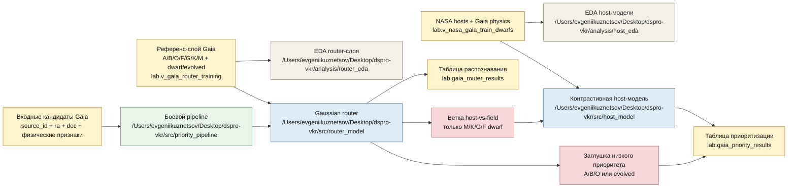

# Схема боевого pipeline

Ниже зафиксирована рабочая архитектура проекта после разделения
физического `router`-слоя, `host-vs-field` модели и боевого
`decision layer`.

## Смысл схемы

1. `analysis/router_eda` проверяет и документирует физическую структуру
   reference-слоя для router-модели.
2. `src/router_model` распознаёт,
   какая звезда перед нами по физике:
   спектральный класс + эволюционная стадия.
3. Результат распознавания сохраняется в `lab.gaia_router_results`.
4. Только объекты класса `M/K/G/F dwarf`
   идут в `src/host_model`.
5. `src/host_model` считает,
   насколько объект относится к `host` или `field`
   внутри routed stellar class.
6. Если звезда распознана как `A/B/O` или `evolved`,
   применяется заглушка низкого приоритета.
7. Итог сохраняется в `lab.gaia_priority_results`.

## Почему это важно

- не смешивается физическое распознавание
  и `host-vs-field` scoring;
- карлики и evolved разделены;
- `A/B/O` не загрязняют host-модель;
- архитектура становится воспроизводимой
  и объяснимой для ВКР.
