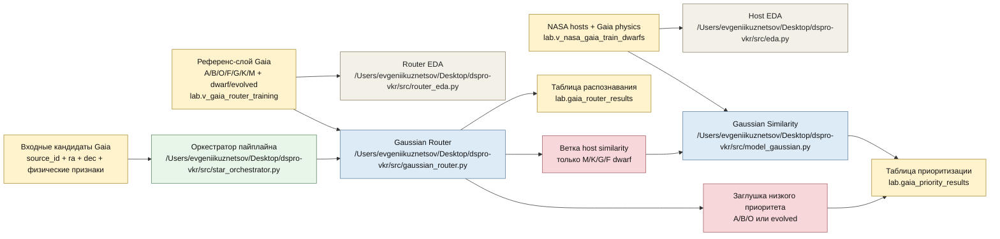

# Схема Пайплайна Router + Host Similarity

Ниже зафиксирована рабочая архитектура проекта после разделения
`router`-слоя и `host similarity`-слоя.

## Смысл схемы

1. `router_eda.py` проверяет и документирует физическую структуру
   reference-слоя для router-модели.
2. `gaussian_router.py` распознаёт,
   какая звезда перед нами по физике:
   спектральный класс + эволюционная стадия.
3. Результат распознавания сохраняется в `lab.gaia_router_results`.
4. Только объекты класса `M/K/G/F dwarf`
   идут в `model_gaussian.py`.
5. `model_gaussian.py` считает,
   насколько объект похож на известные NASA host-stars.
6. Если звезда распознана как `A/B/O` или `evolved`,
   применяется заглушка низкого приоритета.
7. Итог сохраняется в `lab.gaia_priority_results`.

## Почему это важно

- не смешивается физическое распознавание
  и похожесть на host-stars;
- карлики и evolved разделены;
- `A/B/O` не загрязняют host-модель;
- архитектура становится воспроизводимой
  и объяснимой для ВКР.
