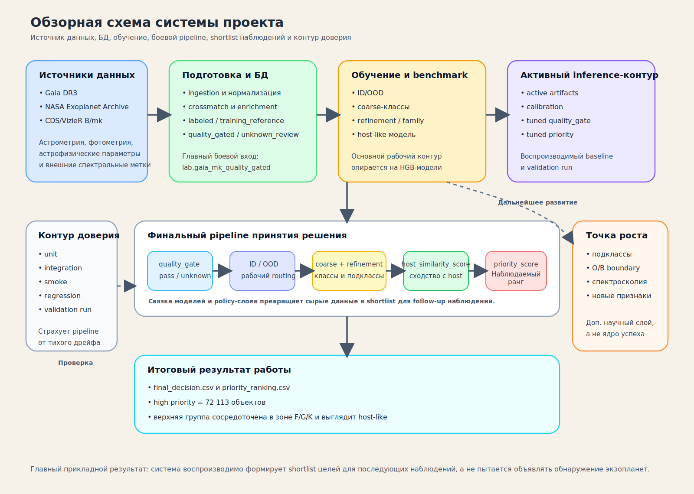

# Интерпретация Для ВКР

Здесь лежит не raw review-слой, а связный текстовый пакет для ВКР.

Этот раздел отвечает на вопрос:

- как корректно описать главный результат работы;
- почему итоговому shortlist можно доверять;
- где проходят границы результата и точки дальнейшего роста.

Основные документы:

- [system_overview_ru.svg](/Users/evgeniikuznetsov/Desktop/dspro-vkr/docs/assets/diagrams/system_overview_ru.svg)
- [vkr_interpretation_source_of_truth_2026_04_06_ru.md](/Users/evgeniikuznetsov/Desktop/dspro-vkr/docs/methodology/vkr/vkr_interpretation_source_of_truth_2026_04_06_ru.md)
- [vkr_main_result_outline_2026_04_06_ru.md](/Users/evgeniikuznetsov/Desktop/dspro-vkr/docs/methodology/vkr/vkr_main_result_outline_2026_04_06_ru.md)
- [vkr_high_priority_interpretation_2026_04_06_ru.md](/Users/evgeniikuznetsov/Desktop/dspro-vkr/docs/methodology/vkr/vkr_high_priority_interpretation_2026_04_06_ru.md)
- [vkr_model_quality_interpretation_2026_04_06_ru.md](/Users/evgeniikuznetsov/Desktop/dspro-vkr/docs/methodology/vkr/vkr_model_quality_interpretation_2026_04_06_ru.md)
- [vkr_policy_layer_interpretation_2026_04_06_ru.md](/Users/evgeniikuznetsov/Desktop/dspro-vkr/docs/methodology/vkr/vkr_policy_layer_interpretation_2026_04_06_ru.md)
- [vkr_result_trust_interpretation_2026_04_06_ru.md](/Users/evgeniikuznetsov/Desktop/dspro-vkr/docs/methodology/vkr/vkr_result_trust_interpretation_2026_04_06_ru.md)
- [vkr_limitations_interpretation_2026_04_06_ru.md](/Users/evgeniikuznetsov/Desktop/dspro-vkr/docs/methodology/vkr/vkr_limitations_interpretation_2026_04_06_ru.md)

Если нужен инженерный фактологический слой, смотри:

- [run_reviews](/Users/evgeniikuznetsov/Desktop/dspro-vkr/docs/methodology/run_reviews/README.md)

Если нужен план того, как этот пакет собирался, смотри:

- [vkr_interpretation_tz_ru.md](/Users/evgeniikuznetsov/Desktop/dspro-vkr/docs/methodology/plans/vkr_interpretation_tz_ru.md)

Внутренний микро-план интерпретационного пакета ведется вне публичного контура
репозитория.
