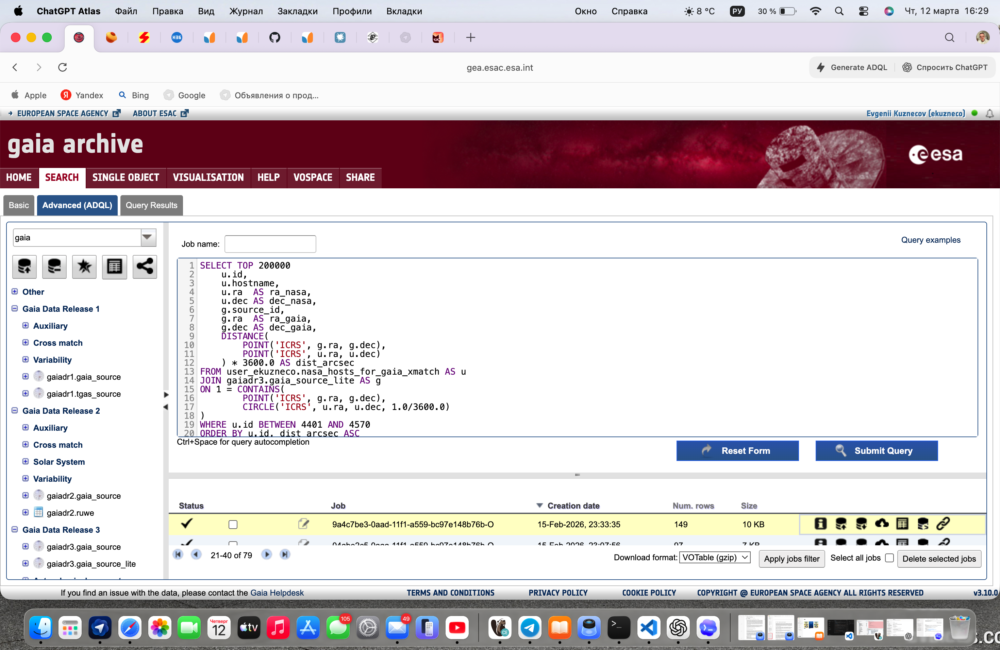
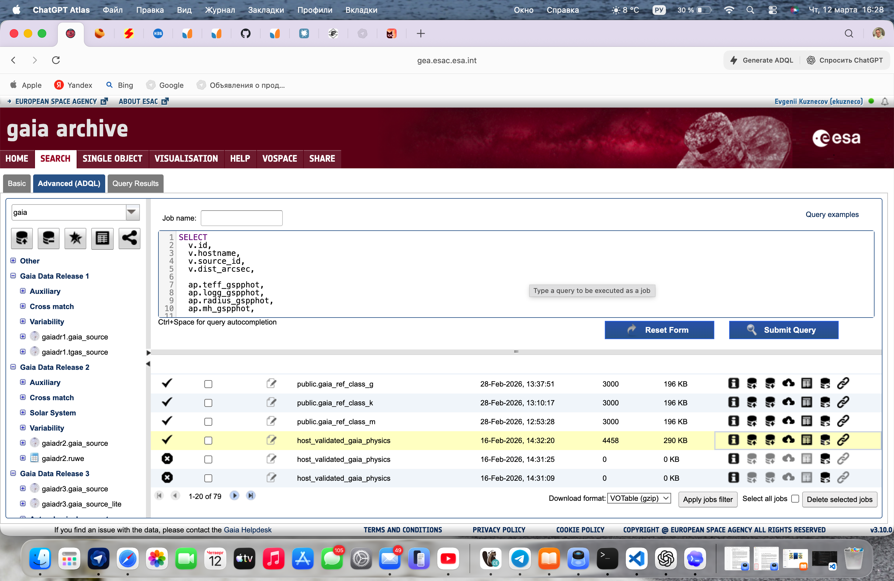

# Preprocessing pipeline и data lineage

Дата: 12 марта 2026 года

## 1. Назначение

Этот документ описывает слой подготовки данных для проекта:

- откуда берутся исходные каталоги;
- как выполняется crossmatch NASA x Gaia;
- как формируются train- и reference-наборы;
- какие таблицы и признаки дальше используются в Python-контуре.

Документ не заменяет SQL и ADQL-файлы, а связывает их в единый pipeline.

## 2. Внешние источники данных

Проект опирается на два основных внешних архива:

- [Gaia Archive](https://gea.esac.esa.int/archive/) — источник астрометрии,
  фотометрии и физических параметров Gaia DR3;
- [NASA Exoplanet Archive](https://exoplanetarchive.ipac.caltech.edu/) —
  источник подтверждённых экзопланет и их звёзд-хостов.

Для пояснительной записки и preprocessing-ноутбука допустимо отдельно
показывать интерфейс [Gaia Archive](https://gea.esac.esa.int/archive/) как
источник ADQL-запросов и выгрузок reference/data-engineering артефактов.

В repo уже сохранены два скрина интерфейса Gaia Archive:

- `docs/assets/gaia_archive_crossmatch_ui.png` — пример batch crossmatch;
- `docs/assets/gaia_archive_validation_ui.png` — пример validation/enrichment.

Иллюстрации:

## 3. Логика подготовки данных

### 3.1 Crossmatch NASA host-stars с Gaia DR3

На первом этапе список звёзд-хостов из NASA сопоставляется с Gaia DR3
по координатам в системе `ICRS`.

Практический режим работы:

- crossmatch выполнялся batch-пачками по 100 звёзд;
- одна пачка занимала примерно 15 минут;
- такой режим позволял контролировать качество сопоставления и не ждать
  слишком долго один большой запрос.

Канонический ADQL-шаблон для такого режима сохранён в:

- [01_nasa_hosts_crossmatch_batch_template.adql](/Users/evgeniikuznetsov/Desktop/dspro-vkr/sql/adql/01_nasa_hosts_crossmatch_batch_template.adql)

Что извлекается на этом шаге:

- `id`, `hostname`, `ra_nasa`, `dec_nasa`;
- `source_id`, `ra_gaia`, `dec_gaia`;
- `dist_arcsec` как угловое расстояние между объектами.

### 3.2 Валидация и enrichment физическими параметрами

После первичного crossmatch выбранные `source_id` дополнительно обогащаются
через Gaia DR3:

- физика из `gaiadr3.astrophysical_parameters`;
- quality и photometry поля из `gaiadr3.gaia_source`.

Канонический ADQL для этого шага сохранён в:

- [02_validation_physics_enrichment.adql](/Users/evgeniikuznetsov/Desktop/dspro-vkr/sql/adql/02_validation_physics_enrichment.adql)

На этом шаге подтягиваются ключевые поля:

- `teff_gspphot`;
- `logg_gspphot`;
- `radius_gspphot`;
- `mh_gspphot`;
- `ruwe`;
- `parallax`;
- `parallax_over_error`;
- `phot_g_mean_mag`;
- `bp_rp`.

### 3.3 Построение обучающей host-выборки

На локальной стороне из crossmatch и enrichment-данных собираются:

- `lab.nasa_gaia_crossmatch`;
- `lab.nasa_gaia_train`.

Содержательно этот этап включает:

- контроль качества `dist_arcsec`;
- выбор ближайшего match для каждого `source_id`;
- удаление дублей;
- отбор строк с полной физикой для `Gaussian similarity`.

Именно этот этап потом кормит:

- `src/host_model`;
- `src/priority_pipeline`;
- часть EDA и calibration-контура.

Канонический SQL для этого слоя теперь разложен в:

- [01_nasa_gaia_crossmatch.sql](/Users/evgeniikuznetsov/Desktop/dspro-vkr/sql/preprocessing/01_nasa_gaia_crossmatch.sql)
- [02_train_classification_views.sql](/Users/evgeniikuznetsov/Desktop/dspro-vkr/sql/preprocessing/02_train_classification_views.sql)

Практический порядок запуска preprocessing-слоя:

1. `01_nasa_gaia_crossmatch.sql`
2. `02_train_classification_views.sql`
3. `03_router_reference_layer.sql`
4. `04_data_quality_checks.sql`

## 4. Reference layer для router

Для самого `router` используется не только host-train, но и отдельные
референсные Gaia-выборки, которые позволяют описывать физические популяции
звёзд по классам и стадиям.

Примеры ADQL-запросов для таких выборок сохранены в:

- [03_gaia_reference_sampling_examples.adql](/Users/evgeniikuznetsov/Desktop/dspro-vkr/sql/adql/03_gaia_reference_sampling_examples.adql)

В текущем наборе уже зафиксированы реальные примеры:

- выборка `O`-звёзд;
- выборка `A`-звёзд.

По той же схеме формируются и остальные reference-выборки для
`M/K/G/F` и других физических веток.

Канонический SQL для router reference layer теперь лежит в:

- [03_router_reference_layer.sql](/Users/evgeniikuznetsov/Desktop/dspro-vkr/sql/preprocessing/03_router_reference_layer.sql)

В живой локальной БД также существует вспомогательная view
`lab.v_gaia_ref_abo_training`. Она пригодна для legacy-EDA, но не является
центральной точкой для текущего production/router-контура, поэтому в
канонический preprocessing-слой не включена как обязательная.

## 5. Ключевые признаки preprocessing-слоя

Ядро физического описания:

- `teff_gspphot`;
- `logg_gspphot`;
- `radius_gspphot`.

Дополнительные признаки качества и контекста:

- `mh_gspphot`;
- `parallax`;
- `parallax_over_error`;
- `bp_rp`;
- `ruwe`;
- `dist_arcsec`.

## 6. Локальный snapshot, сверенный с Postgres

На 12 марта 2026 года в локальной БД подтверждены следующие объёмы:

- `lab.nasa_gaia_crossmatch` — `4408` строк;
- `lab.nasa_gaia_train` — `3741` строк;
- `lab.v_nasa_gaia_train_dwarfs` — `3394` строки;
- `lab.v_nasa_gaia_train_evolved` — `319` строк;
- `lab.v_gaia_router_training` — `39413` строк.

Этот snapshot нужен как контрольный ориентир при повторной сборке
preprocessing-слоя. После нового crossmatch или обновления reference-таблиц
эти числа могут измениться.

## 7. Что ещё может понадобиться для финальной упаковки

Текущий статус preprocessing-слоя:

- ADQL-артефакты уже сохранены в repo;
- markdown-описание data lineage уже заведено;
- DBeaver preprocessing-логика уже разложена на канонические SQL-файлы в
  `sql/preprocessing/`;
- notebook [00_data_extraction_and_preprocessing.ipynb](/Users/evgeniikuznetsov/Desktop/dspro-vkr/notebooks/eda/00_data_extraction_and_preprocessing.ipynb)
  уже создан и связан с ADQL/SQL-слоем;
- в notebook уже добавлены три пары `до/после`:
  `validation_unique -> nasa_gaia_train`,
  `nasa_gaia_crossmatch -> nasa_gaia_train`,
  `classified_MKGF -> v_nasa_gaia_train_dwarfs`;
- скрины интерфейса [Gaia Archive](https://gea.esac.esa.int/archive/) уже
  сохранены в `docs/assets/` и готовы для ВКР.

Следующие ближайшие артефакты носят уже упаковочный характер:

- при необходимости, дополнительный блок графиков `до/после` для финальной
  версии пояснительной записки.

Контрольные SQL-проверки вынесены отдельно в:

- [04_data_quality_checks.sql](/Users/evgeniikuznetsov/Desktop/dspro-vkr/sql/preprocessing/04_data_quality_checks.sql)

## 8. Связанные документы

- [preprocessing_and_comparison_tz_ru.md](/Users/evgeniikuznetsov/Desktop/dspro-vkr/docs/preprocessing_and_comparison_tz_ru.md) —
  рабочее ТЗ на packaging preprocessing и блок сравнений;
- [vkr_requirements_traceability_ru.md](/Users/evgeniikuznetsov/Desktop/dspro-vkr/docs/vkr_requirements_traceability_ru.md) —
  карта соответствия проекта требованиям ВКР.
