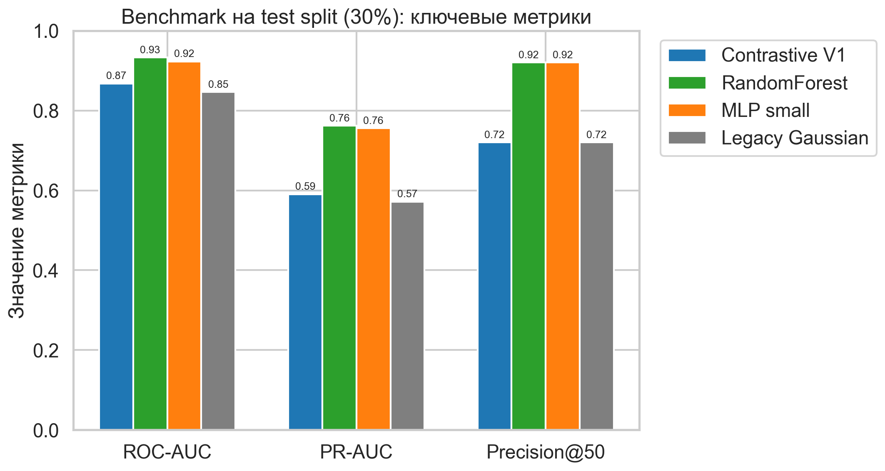
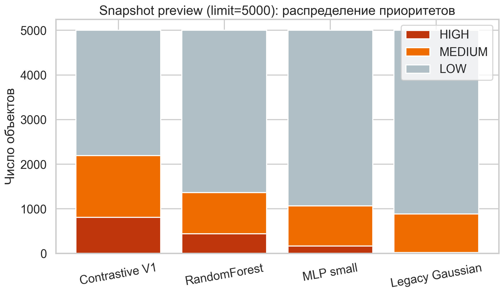
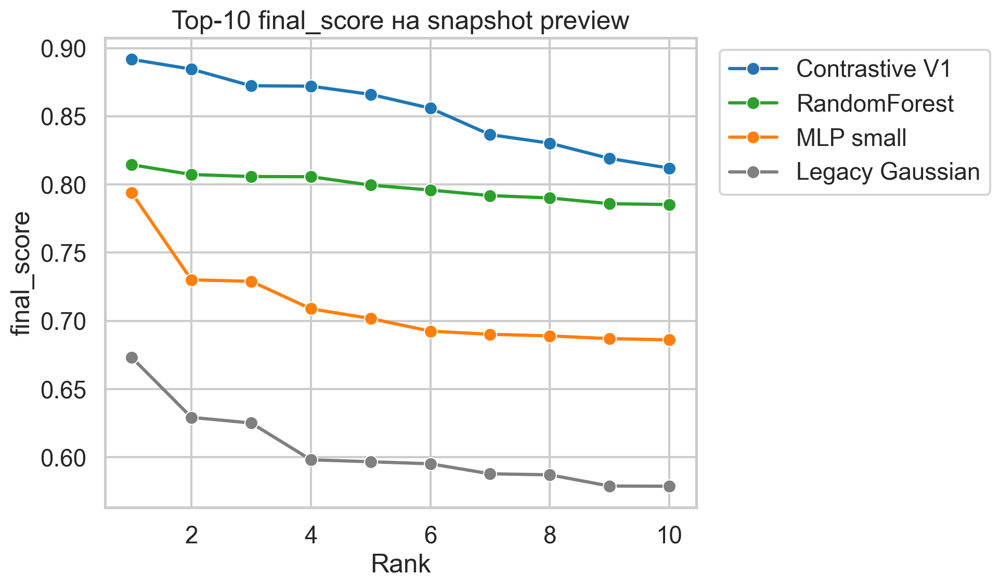

# Черновик слайдов ВКР

Дата фиксации: 13 марта 2026 года

Формат этого документа:
- это slide-source, а не готовый `.pptx`;
- графики и таблицы уже собраны в `docs/presentation/assets/baseline_comparison_2026-03-13_vkr30_cv10`;
- содержимое синхронизировано с benchmark `baseline_comparison_2026-03-13_vkr30_cv10`
  и snapshot preview
  `baseline_comparison_2026-03-13_vkr30_cv10_limit5000_snapshot`.

## Слайд 1. Тема и цель

Заголовок:
`Physically Consistent Prioritization of Stellar Targets for Exoplanet Follow-up`

Тезисы на слайде:
- Цель проекта: не доказать наличие экзопланеты, а ранжировать звёзды для последующих наблюдений.
- Объект: звёзды `M/K/G/F dwarf` после router и OOD-контроля.
- Результат: reproducible pipeline, benchmark baseline-моделей и operational ranking.

Комментарий докладчика:
- Ключевая постановка задачи: при ограниченном времени телескопа нужен shortlist объектов с максимальной вероятностью полезного follow-up.

## Слайд 2. Постановка задачи

Тезисы на слайде:
- Вход: Gaia-подобные каталожные признаки и физические оценки звезды.
- Исследовательский вопрос: как оценивать `host vs field` так, чтобы ranking оставался физически интерпретируемым.
- Ограничение: сильная supervised-метрика ещё не гарантирует лучшую operational usefulness.

Комментарий докладчика:
- Отдельно проговорить, что project objective шире обычной бинарной классификации: в конце есть decision layer и приоритизация.

## Слайд 3. Архитектура решения

Тезисы на слайде:
- `router` определяет физический класс звезды и отсекает `UNKNOWN/OOD`.
- `host-model` считает `host vs field` для релевантной dwarf-популяции.
- `decision layer` строит `final_score` и приоритет `HIGH / MEDIUM / LOW`.

Комментарий докладчика:
- Здесь лучше показать схему из записки или быстро собрать финальный рисунок в PowerPoint.
- На слайде достаточно трёх блоков: `router -> host-model -> decision layer`.

## Слайд 4. Данные и benchmark-контур

Тезисы на слайде:
- Benchmark строится на выделенном `host` и `field` датасете.
- Test split увеличен до `30%`, train остаётся внутри tuning-контура.
- Сравниваются четыре модели: `main_contrastive_v1`, `legacy_gaussian`, `random_forest`, `mlp_small`.

Ключевые числа:
- `N test = 4619`
- `Host = 1019`
- `Field = 3600`

Вставка:
- [benchmark_test_table.csv](./assets/baseline_comparison_2026-03-13_vkr30_cv10/benchmark_test_table.csv)

## Слайд 5. Методическая модернизация для ВКР

Тезисы на слайде:
- `test_size = 0.30`
- `10-fold Stratified CV`
- единый `refit_metric = roc_auc`
- search-контур для всех четырёх моделей

Комментарий докладчика:
- Подчеркнуть, что benchmark теперь методически строгий и воспроизводимый.
- Для `RF` и `MLP` используется `GridSearchCV`, для Gaussian-моделей эквивалентный manual CV search.

Вставка:
- [search_summary_table.csv](./assets/baseline_comparison_2026-03-13_vkr30_cv10/search_summary_table.csv)

## Слайд 6. Основные benchmark-результаты

Тезисы на слайде:
- Лучшие benchmark-метрики показали `RandomForest` и `MLP`.
- `RandomForest`: `ROC-AUC 0.9326`, `PR-AUC 0.7618`, `Precision@50 = 0.92`
- `MLP small`: `ROC-AUC 0.9227`, `PR-AUC 0.7555`, `Precision@50 = 0.92`
- `Contrastive V1`: `ROC-AUC 0.8674`, `PR-AUC 0.5904`, `Precision@50 = 0.72`

Вставка:
- 

Комментарий докладчика:
- Здесь важно честно признать лидерство RF/MLP по supervised benchmark.

## Слайд 7. Поведение по спектральным классам

Тезисы на слайде:
- `K`-ветка остаётся самой стабильной для всех моделей.
- `M`-ветка чувствительнее к выбору модели и конфигурации.
- Classwise анализ подтверждает, что глобальная метрика не раскрывает весь профиль поведения.

Вставка:
- 

Комментарий докладчика:
- Отдельно отметить, что tuning был нужен не только формально, но и практически: class-specific поведение различается.

## Слайд 8. Search summary и выбранные конфигурации

Тезисы на слайде:
- `Contrastive V1`: `use_m_subclasses=false`, `shrink_alpha=0.05`, `min_population_size=2`
- `Legacy Gaussian`: `use_m_subclasses=true`, `shrink_alpha=0.15`
- `RF` и `MLP` подбирались отдельно по `F/G/K/M`.

Комментарий докладчика:
- Это сильный слайд для защиты формальной методики: параметры теперь выбираются не вручную, а по CV-контуру.

Вставка:
- [search_summary_table.csv](./assets/baseline_comparison_2026-03-13_vkr30_cv10/search_summary_table.csv)

## Слайд 9. Operational snapshot preview

Тезисы на слайде:
- Snapshot preview выполнен на `5000` входных строках production-like relation.
- `Contrastive V1` формирует самый насыщенный `HIGH`-tier: `811`.
- `RandomForest` даёт более консервативный, но всё ещё сильный ranking: `439 HIGH`.
- `Legacy Gaussian` почти не поднимает объекты в `HIGH`: `18`.

Вставка:
- 

Комментарий докладчика:
- Это ключевой переход от benchmark-метрик к operational usefulness.

## Слайд 10. Профиль top-ranked объектов

Тезисы на слайде:
- `Contrastive V1` сохраняет самый высокий `final_score` в верхней части ranking.
- Ranking у `RF` более ровный, но менее агрессивный по `HIGH`-tier.
- `Legacy Gaussian` заметно уступает уже на первых rank-позициях.

Вставка:
- 

Комментарий докладчика:
- Это удобно использовать как аргумент, почему лучшая ROC-AUC не равна лучшему shortlist для наблюдений.

## Слайд 11. Почему production остаётся contrastive-first

Тезисы на слайде:
- Production-цель проекта: физически согласованная приоритизация, а не только максимум supervised-метрики.
- `Contrastive V1` лучше вписывается в цепочку `router + OOD + decision layer`.
- Snapshot preview показывает, что именно contrastive-модель даёт самый сильный operational ranking.

Комментарий докладчика:
- Здесь важно развести два уровня:
- benchmark winner по метрикам;
- production winner по физической и operational интерпретируемости.

## Слайд 12. Примеры top-кандидатов и итог

Тезисы на слайде:
- Top shortlist основной модели состоит из компактных `M dwarf` с высоким `host_posterior`.
- Проект получил воспроизводимый benchmark, обновлённые артефакты и формально корректный comparison-контур.
- Следующий шаг: перенос этих результатов в финальную записку и презентацию.

Вставка:
- [contrastive_top_table.csv](./assets/baseline_comparison_2026-03-13_vkr30_cv10/contrastive_top_table.csv)

Итоговая фраза:
- `RandomForest` и `MLP` сильнее по benchmark-метрикам, но `Contrastive V1` остаётся предпочтительной production-моделью для физически согласованного ранжирования.
